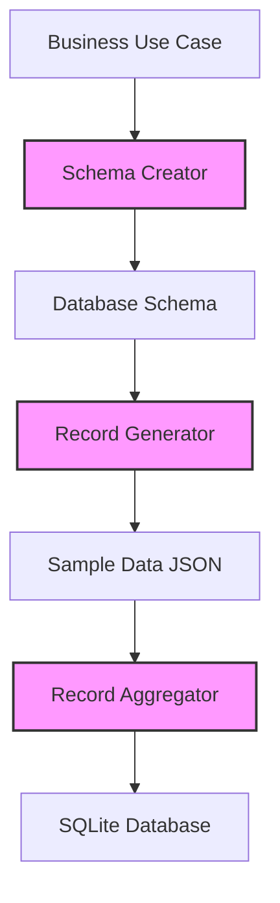

# crewai-tutorial

This repo contains notebooks from the DeepLearning.ai course on CrewAI

### Goal: port it to Ollama running locally

Run a simple crew using Llama 3.1 70b running locally.

The goal of the crew is to generate synthetic data that conforms to a given schema. This schema is informed by a business use case.

The crew should consist of 3 agents:
1. Schema Creator: Given the business use case, the schema creator outputs a SQLite database schema of a table that has relevant fields and data types to store data related to that use case
2. Record Generator: Given a schema, the record generator generates sample data and returns it in the form of a JSON object of key-value pairs
3. Record Aggregator: The Record Aggregator takes in records generated by the Record Generator and writes it into a local SQLite database

